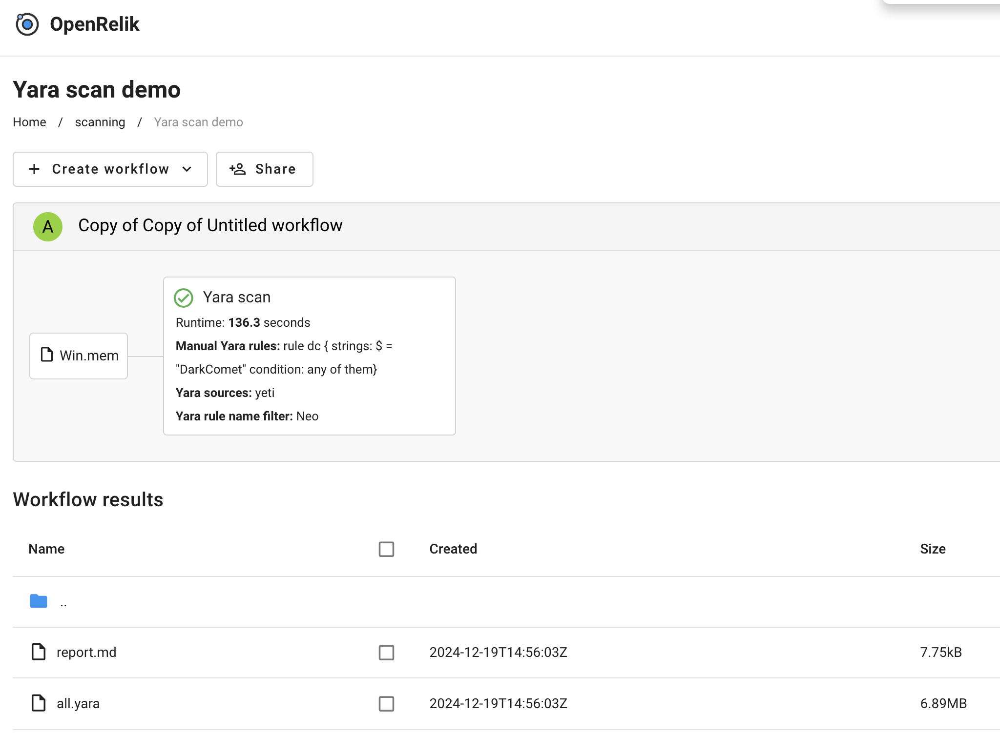

# Yara scanner OpenRelik worker

## Overview

This worker scans input files with Yara rules and the official libyara python
library.

It can source the rules from manual input (as a parameter) or from a third-party
TIP.

## Settings

### Global settings

- `Manual Yara rules` (optional): The Yara rules to use for the scan. These
  rules will be concatenated after rules obtained from third-party providers.
- `Yara sources` (optional): The third-party TIPs to use for the scan. Can
  provide more than one, comma-separated.
- `Yara rule name filter` (optional): Only select rules containing this
  substring for the scan.

### Yeti (third-party TIP)

- [Yeti platform homepage](https://yeti-platform.io)

Two parameters are needed, that are passed through environment variables

- `YETI_ENDPOINT`: The URL of the Yeti platform
- `YETI_API_KEY`: The API key to authenticate with the Yeti platform
